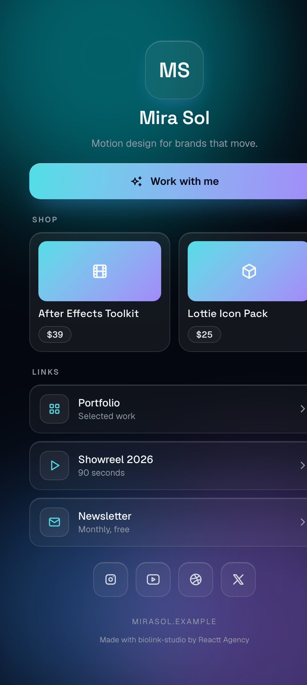

# biolink-studio

A Claude Code skill that interviews you, then builds you a beautiful, standalone
**link-in-bio** page as a single `index.html`. No accounts, no monthly fee, no build step.
You own the file and host it anywhere.

It is not a fill-in template. Claude asks what your page is about and a few design questions
first, then assembles the page from an audited base: a dark glass aesthetic, a drifting aurora
backdrop, a gradient call-to-action, and accessibility that passes WCAG 2.2 AA.



## What you get

- One self-contained `index.html`. Fonts and icons load from a CDN; everything else is inline.
- Six gradient **vibes**: Aurora, Spectrum, Mint, Sunset, Ocean, Mono. Each is contrast-checked.
- Frosted glass surfaces, a gradient CTA, glass link-buttons, and product tiles with prices.
- Real craft: staggered entrance, gated hover, press feedback, `prefers-reduced-motion`,
  visible focus, large touch targets, proper headings, and AA-checked color.
- Sections you actually use: a primary action, products, link rows, and socials. Empty
  sections are removed, not left blank.

## Install

Drop the folder into your Claude Code skills directory:

```bash
git clone https://github.com/<your-username>/biolink-studio.git ~/.claude/skills/biolink-studio
```

Then start Claude Code in any folder and ask, or run `/biolink-studio`.

## Use

> "Make me a link in bio for my motion design studio."

Claude will:
1. Ask about your page (name, bio, your one main action, links, products, socials).
2. Ask which vibe fits and confirm.
3. Write `index.html` and show it to you.

Then host it free: drag the file onto [Netlify Drop](https://app.netlify.com/drop), push it to
a GitHub repo with Pages enabled, or deploy with Vercel.

## Customize

- Gradient palettes live in [`reference/vibes.md`](reference/vibes.md). Add your own by copying
  a block and changing the two accent tokens (OKLCH).
- The base page is [`assets/template.html`](assets/template.html). A finished sample is in
  [`examples/mira-sol`](examples/mira-sol).
- The rules that keep output accessible and on-craft are in
  [`reference/design-system.md`](reference/design-system.md).

## Accessibility

Generated pages target WCAG 2.2 AA: a single `<h1>`, section headings, labeled controls,
AA contrast (including dark text on the gradient and muted text on the dark background),
large touch targets, keyboard focus, and a full reduced-motion fallback.

## License

MIT. See [LICENSE](LICENSE). Made by [Reactt Agency](https://reacttagency.com), built with [Claude Code](https://claude.com/claude-code).
